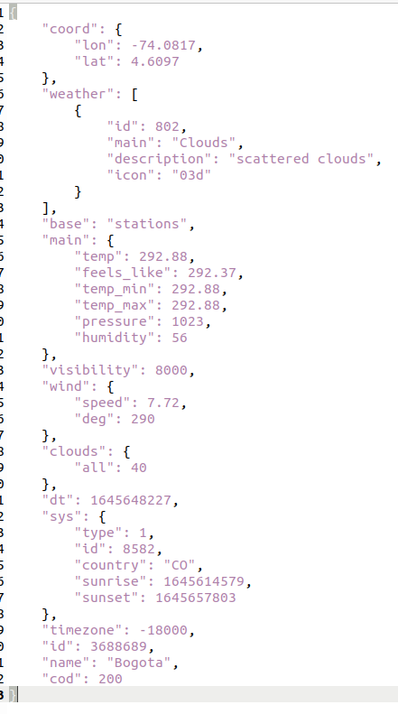

# PARCIAL AREP
EL Objetivo principal es consumir una api desde el backend montado en heroku a https://openweathermap.org, esta api se va a consumir mediante un browser

### Despliegue Heroku
[]()

### Aplicativo:

El aplicativo cuenta con un socket HTTP que responde al puerto 36000 alli se podra acceder al servidor web donde podra indicar cual ciudad desea consultar

 


una vez ingresada la ciudad este va a consumir la API expuesta por https://openweathermap.org


Por medio de una peticion Ajax se va a realizar un get hacia la ruta /consulta/ciudad=city donde el backend dentro de la carpeta Service tomara esta peticion y retornara el JSON expuesto por la API



### Como Ejecutarlo?

Se debe iniciar el websocket 

### Prerrequisitos

Los pasos a continuación permiten clonar el programa en su computador.


Eston son los requisitos que software que tienen que estar instalados previamente:

```
Maven
```
```
Git
```
```
Fue ejecutado con version java 1.8
```


## Construcción 
* [Maven](https://maven.apache.org/) - Dependencias de maven

## Fecha
* 23 Febrero 2022

## Autores

* **Mateo Quintero Acevedo** 

## Javadoc

* El javadoc fue obtenido mediante la herramienta eclipse quien cuenta con la opcion de autogenerado
	
## Licencia

En este proyecto se usó la licencia GNU - se puede ver [LICENSE](LICENSE) para más detalles.

